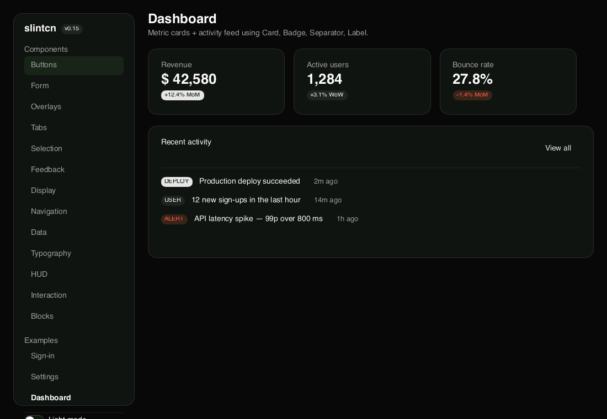
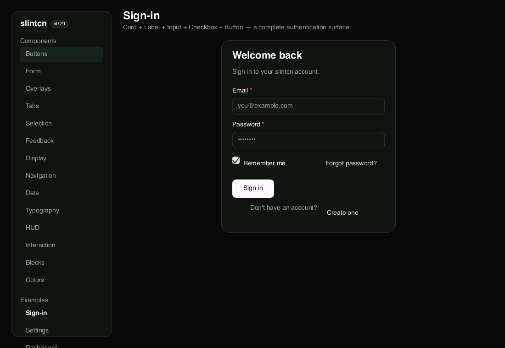
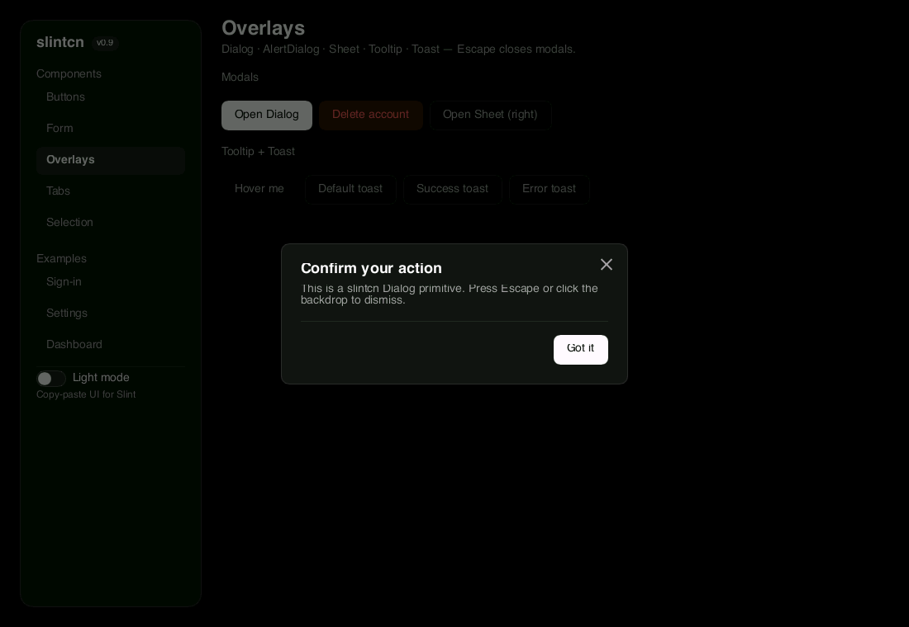

# slintcn

[](https://github.com/stevekwon211/slintcn/actions/workflows/pages.yml)
[](LICENSE)

**Copy-paste Slint components that don't look like 2009 desktop widgets.**

**Live demo**: [stevekwon211.github.io/slintcn](https://stevekwon211.github.io/slintcn) - the full showcase running in your browser via Slint compiled to WebAssembly (~7 MB bundle, FemtoVG + WebGL2). Click around to verify every primitive interactively.

<p align="center">
  
  
  
</p>

## Why it exists

shadcn proved that developers want to *own* UI code, not fight a theme API.
Slint 1.16 is moving to Fluent as the default — fine for consistency, weak for
modern dark/glass product UI. **slintcn** is the missing layer: tokens + primitives
you copy into your repo and customize.

## Quick start

```bash
# Run the visual showcase
cd examples/showcase && cargo run

# Install components into your Slint project (once published to npm)
cd your-app
npx slintcn@latest init
npx slintcn@latest add button card input dialog

# …or from a local checkout today (pre-publish):
node /path/to/slintcn/bin/slintcn.mjs init
node /path/to/slintcn/bin/slintcn.mjs add button card input dialog
```

Files land in `ui/slintcn/` — **you own them**. Change colors in
`ui/slintcn/theme/tokens.slint`, tweak `button.slint` for your product.

## Philosophy

| Phase | Focus | Status |
|-------|--------|--------|
| **v0.1** | SaaS-adjacent dark glass — Button, Card, Input, Badge | ✅ |
| **v0.1.1** | Foundation hardening — enum variants, focus ring, dogfooded showcase | ✅ |
| **v0.2** | Shell + overlays — Label, Separator, Dialog, AlertDialog, Sheet, Tooltip, Toast | ✅ |
| **v0.3** | Selection primitives + docs-style showcase — Tabs, Checkbox, Switch + Sign-in / Settings / Dashboard examples | ✅ |
| **v0.4** | Select / RadioGroup / Icon + stacked Toast + runtime light/dark `Theme.mode` swap | ✅ |
| **v0.5** | Arrow-key nav, horizontal RadioGroup, modal focus trap, build.rs scaffold hint | ✅ |
| **v0.6** | PopupWindow-based Tooltip (escapes parent bounds) + font embedding guide | ✅ |
| **v0.7** | Growable Rust-backed Toast queue + headless snapshot CI (SoftwareRenderer) | ✅ |
| **v0.8** | PopupWindow Select (focus-based) + Toast fade-out + per-section snapshots + GitHub Actions | ✅ |
| **v0.9** | **shadcn fidelity pass** — token recalibration (h-9, px-4, radius 10, spacing-xl/2xl), segmented Tabs, Dialog X-close + p-6 + click-absorb, all 18 primitives to measured shadcn specs | ✅ |
| **v0.10** | **Breadth batch A** — Accordion, Avatar, Textarea, Progress, Alert, Skeleton, Toggle, ToggleGroup (26 components) | ✅ |
| **v0.11** | **Breadth batch B** — Breadcrumb, Pagination, Table, Slider (30 components) | ✅ |
| **v0.12** | **Web-parity P0** — Text typography + game/HUD trio (Keycap, HudPill, SlotTile) + variant axes (Card padding/radius, Badge ghost/link, Tabs line) (34 components) | ✅ |
| **v0.13** | **Web-parity P1/P2** — ScrollArea (Flickable + custom scrollbar), Popover, ContextMenu (right-click) (37 components) | ✅ |
| **v0.14** | **Distribution backbone** — registry metadata (type/title/category), CLI `list`/`view`/`build`, remote-URL + namespaced install, npm/HTTP-ready | ✅ |
| **v0.15** | **Blocks** — sign-in, login, pricing, dashboard, settings as installable `registry:block` templates | ✅ |
| **v0.16** | **Theming** — base-color variants (neutral/zinc/slate/stone) via `slintcn init --base-color` + Colors reference | ✅ |
| **v0.17** | **Docs IA** — showcase as a docs site: install command + usage code per component section | ✅ |
| **v0.18** | **Docs site (ui.shadcn.com clone)** — generated per-component pages with live WASM preview + install tabs + usage code + sidebar IA at `/docs` | ✅ |
| **v0.19** | Docs getting-started pages (Introduction/Installation/Theming/CLI/Registry) + components index | upcoming |
| **v1.0** | Game HUD registry expansion — hotbar, reticle, full keycap hints | later |

SaaS-first is a **wedge**, not a ceiling. Once tokens + motion + hover semantics
exist, a second registry (`registry/game/`) is just more `.slint` files.

## Prerequisites

- **Rust** with Slint 1.16 (for the showcase or your Slint app)
- **Node 20+** (the CLI runtime)

```slint
import { Button, ButtonVariant, ButtonSize } from "slintcn/components/button.slint";
import { Dialog } from "slintcn/components/dialog.slint";

Button {
    variant: ButtonVariant.glow;
    size: ButtonSize.lg;
    text: "Ship it";
    clicked => { my-dialog.open = true; }
}

// Modal must be the LAST child of Window:
my-dialog := Dialog {
    width: parent.width;
    height: parent.height;
    title: "Confirm";
    description: "Ship to production?";
}
```

Variants and sizes are **typed enums** — a typo fails to compile rather than
silently falling through to the default styling.

## CLI & distribution

slintcn isn't a library you depend on — it's a **distribution system for
copy-paste Slint code** (the shadcn model). The CLI:

```bash
slintcn init                       # create slintcn.json + install theme tokens
slintcn add button card input      # copy components + their deps (import-rewritten)
slintcn list                       # browse the catalog, grouped by category
slintcn view dialog [--files]      # an item's metadata, install order, and source
slintcn build -o dist/registry     # emit a static registry (registry.json + r/*.json)
```

**Config — `slintcn.json`** (created by `init`): `style` (which registry),
`baseColor` (`neutral` · `zinc` · `slate` · `stone` — pick at init with
`slintcn init --base-color zinc`), `outDir`/`themeDir`/`componentsDir`/`blocksDir`
(where files land — fully relocatable, imports are rewritten to match), and
`registries` (namespace → URL).

**Remote / custom registries.** `slintcn build` emits a static registry —
a `registry.json` index plus `r/<name>.json` files with each component's
source inlined. Host that anywhere and install from it:

```bash
slintcn add https://stevekwon211.github.io/slintcn/r/button.json   # direct URL
slintcn add @acme/button                                           # via registries config
```

`registryDependencies` (e.g. a component needing `theme`) resolve recursively
against the same registry. The official registry is served at
`https://stevekwon211.github.io/slintcn/r/`.

> **Maintainers:** publish to npm with `npm login && npm publish` (the package
> ships `bin`, `registry`, `templates`, `schema`; `prepublishOnly` runs tests).

## Components (default registry)

### Form primitives
| Component | Variants | Sizes |
|-----------|----------|-------|
| **Button** | default · outline · secondary · ghost · link · destructive · glow · glass | xs · sm · default · lg · icon (× 4 sizes) |
| **Card** | solid · glass · glass-interactive · raised (+ CardHeader/Title/Description/Content/Footer) | sm · default |
| **Input** | (focus ring · placeholder · password · auto-focus) | — |
| **Textarea** | (multi-line, word-wrap) | — |
| **Badge** | default · secondary · outline · destructive | sm · default |
| **Label** | default · muted · required | — |
| **Separator** | horizontal · vertical | — |

### Selection
| Component | Variants | Notable props |
|-----------|----------|---------------|
| **Tabs** | segmented control (muted pill + raised active) | `items: [TabItem]`, `current: int`, `changed(int)` |
| **Checkbox** | (Path-drawn check) | `checked`, `label`, `disabled`, `toggled(bool)` |
| **Switch** | (sliding knob, 36 × 20 track) | `checked`, `label`, `disabled`, `toggled(bool)` |
| **RadioGroup** | vertical · horizontal | `items: [RadioItem]`, `selected: int`, `orientation`, `changed(int)` |
| **Select** | trigger + PopupWindow dropdown (close-on-click-outside) | `items: [SelectItem]`, `selected-index`, `highlighted-index`, `placeholder`, `changed(int)` |
| **Toggle** | default · outline | `text`, `pressed`, `disabled`, `toggled(bool)` |
| **ToggleGroup** | (single-select row) | `items: [ToggleGroupItem]`, `selected: int`, `changed(int)` |

### Display & feedback
| Component | Purpose | Notable props |
|-----------|---------|---------------|
| **Accordion** | single-open collapsible (animated, chevron swap) | `items: [AccordionItem]`, `open-index: int`, `changed(int)` |
| **Avatar** | circular image + initials fallback | `source: image`, `fallback: string`, `size: length` |
| **Alert** | bordered callout with icon | `title`, `description`, `icon` (LucidePaths.*), `variant: default/destructive` |
| **Progress** | horizontal bar | `value: float` (0–100) |
| **Skeleton** | pulsing placeholder | `radius`; size via width/height |

### Navigation & data
| Component | Purpose | Notable props |
|-----------|---------|---------------|
| **Breadcrumb** | navigation path with chevron separators | `items: [BreadcrumbItem]`, `navigate(int)` (last item = current) |
| **Pagination** | prev / page-numbers / next | `total: int`, `current: int` (0-based), `changed(int)` |
| **Slider** | draggable value slider + arrow keys | `value: float`, `minimum`, `maximum`, `changed(float)` |
| **Table** | header + rows, equal-stretch columns | `columns: [string]`, `rows: [TableRow]` (`cells: [string]`) |

### Typography & games/HUD
| Component | Purpose | Notable props |
|-----------|---------|---------------|
| **Text** | typography scale (import `as Typography`) | `variant: display/headline/title/body-lg/body/body-sm/label/caption`, `tone: default/muted/subtle/accent/danger` |
| **Keycap** | keyboard-hint cap for HUDs | `text`, `size: sm/md`, `tone: on-glow/on-glass/muted/affirm-*/deny-*` |
| **HudPill** | rounded-full HUD status pill | `text`, `size: sm/md/lg`, `tone: scrim0/scrim1/scrim2` |
| **SlotTile** | inventory / hotbar slot (holds `@children`) | `tone: stone/empty/accent`, `state: idle/active/disabled`, `interactive`, `size` |

### Interaction (overlay + scroll)
| Component | Purpose | Notable props |
|-----------|---------|---------------|
| **ScrollArea** | clipped Flickable viewport + slim custom scrollbar | `content-height: length`; lay out `@children` to that height |
| **Popover** | click-triggered floating panel (trigger = `@children`) | `title`, `description`, `content-width`; closes on click outside |
| **ContextMenu** | right-click menu over an area (`@children`) | `items: [ContextMenuItemData]`, `selected(int)`; opens at cursor |

### Iconography & theming
| Component | Purpose | Notable props |
|-----------|---------|---------------|
| **Icon** | Path-stroke icon | `commands: string` (24-unit viewBox), `size`, `tint`, `stroke-width` |
| **LucidePaths** | Bundled Lucide command strings | `check · x-mark · chevron-* · plus · minus · arrow-* · dot` |
| **Theme** global | Runtime mode swap | `mode: ThemeMode { dark, light }` — set anywhere; every Tokens binding updates reactively |

### Overlays
| Component | Purpose | Notable props |
|-----------|---------|---------------|
| **Dialog** | General-purpose modal | `open`, `title`, `description`, `dismiss-on-backdrop`, `close-label`, `@children` body |
| **AlertDialog** | Destructive confirm | `open`, `action-label`, `cancel-label`, `action-variant`, `confirmed()`, `cancelled()` |
| **Sheet** | Side drawer | `open`, `side` (top/right/bottom/left), `panel-extent`, `@children` body |
| **Tooltip** | Hover-revealed bubble (PopupWindow — escapes parent bounds) | `text`, `side`; wraps a trigger as `@children` |
| **Toast** | Growable Sonner-shape queue (Rust-backed VecModel) | `ToastQueue.show(text, variant)` — variants: default · success · error |

Keyboard activation (Enter / Space) and a visible 2 px focus ring are wired into
every interactive primitive. Modals close on Escape; Dialog and Sheet close on
backdrop click (configurable). Arrow-key navigation:

- **Tabs** — ← / → cycle the active tab (wrap-around)
- **RadioGroup vertical** — ↑ / ↓ move the selection (wrap)
- **RadioGroup horizontal** — ← / → move the selection (wrap)
- **Select (open dropdown)** — ↑ / ↓ move highlight, Enter commits, Escape closes
- **Dialog / AlertDialog** — Tab trapped inside; AlertDialog cycles Cancel ↔ Action

### Composed examples (showcase)

`cd examples/showcase && cargo run` opens a sidebar-navigated app with three
realistic composed surfaces alongside per-primitive galleries:

- **Sign-in** — Card + Inputs + Checkbox + CTA + footer link
- **Settings** — three-tab preferences (Account / Notifications / Appearance) with Switches and Inputs
- **Dashboard** — 3-column metric Cards with delta Badges + activity feed with Separator-divided rows

## Mounting overlays

Slint has no portal primitive, so modals mount as the **last child** of Window
and span the full window area:

```slint
Window {
    VerticalLayout { /* main UI */ }

    Dialog {
        width: parent.width;
        height: parent.height;
        open <=> dialog-state;
        title: "…";
    }

    Toaster { width: parent.width; height: parent.height; }
}
```

The Scrim in `popup-helpers.slint` only mounts its TouchArea while shown, so
closed modals don't block interaction with the underlying UI.

## vs alternatives

| | std-widgets / Fluent | [slint-ui-system](https://crates.io/crates/slint-ui-system) | **slintcn** |
|--|----------------------|--------------------------------------------------------------|-------------|
| Model | Framework widgets | Crate dependency | **Copy-paste** |
| Aesthetic | Platform / Fluent | Neon dashboard | **Dark glass / shadcn-like** |
| Customize | Theme API | Crate version lock | **Edit the `.slint` file** |
| Overlays | Limited PopupWindow | — | **Dialog · Sheet · Tooltip · Toast** |

## Project layout

```
registry/default/         # Source of truth (published with npm package)
  theme/palette.slint     #   raw color/alpha primitives
  theme/tokens.slint      #   semantic layer (components read this)
  components/*.slint      #   37 primitives + popup-helpers + lucide-paths
examples/showcase/        # Runnable gallery (regenerated via `slintcn add`)
bin/slintcn.mjs           # init + add CLI (transitive deps)
bin/__test__/             # node:test suite — `make test`
```

Run `make verify` before committing — it runs node tests, `cargo build`, and
`cargo clippy -D warnings` end-to-end. Run `make snapshot` to headlessly render
each showcase section to `docs/img/snapshots/section-<n>-<name>.png` via Slint's
SoftwareRenderer (no display server required); per-section baselines live in
the repo for visual-regression diffs.

Quality gate is local (no CI workflow): a tracked **pre-push hook** runs
`make verify` (node tests + cargo build + clippy `-D warnings`) and blocks the
push on failure. Enable it once per clone with `git config core.hooksPath
.githooks`; bypass a single push with `git push --no-verify`. Run `make
snapshot` to refresh the visual-regression baselines.

## Toast Rust glue (required for Toaster to function)

Toast's queue lives in Rust (`slint::VecModel<ToastItem>`) — pure-Slint array
mutation is too limited in 1.16 for a real stack. Mount this glue in your
app's `main.rs`:

```rust
use slint::{ComponentHandle, Model, ModelRc, SharedString, Timer, TimerMode, VecModel};
use std::{cell::RefCell, collections::HashMap, rc::Rc, time::Duration};

let items: Rc<VecModel<ToastItem>> = Rc::new(VecModel::default());
let next_id = Rc::new(RefCell::new(1i32));
let timers: Rc<RefCell<HashMap<i32, Timer>>> = Rc::default();
let queue = ui.global::<ToastQueue>();
queue.set_items(ModelRc::from(items.clone()));
// see examples/showcase/src/main.rs for the full on_show / on_dismiss closures
```

Required Slint feature: `slint = { version = "1.16", features = ["compat-1-2"] }`.
For visual-regression snapshots also enable `"renderer-software"`.

## Roadmap

See [docs/ROADMAP.md](docs/ROADMAP.md).

## License

MIT
